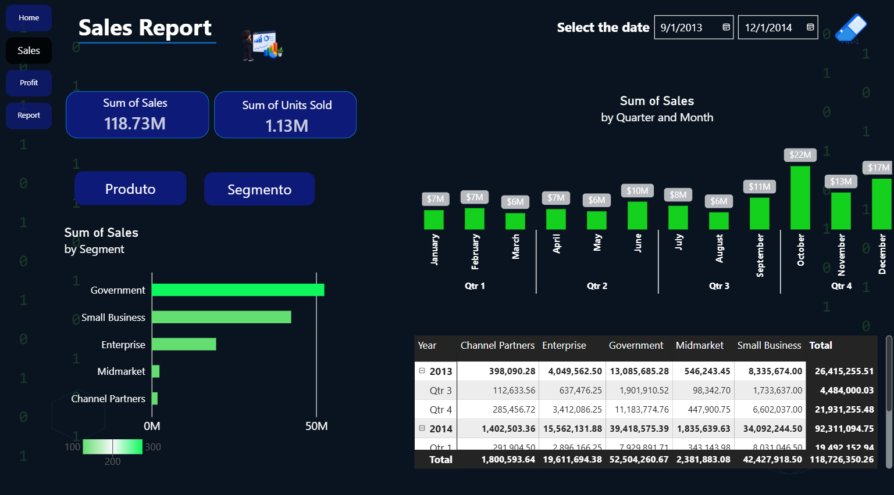
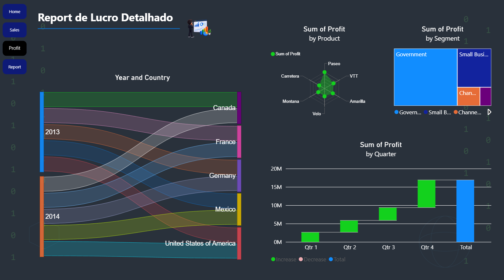
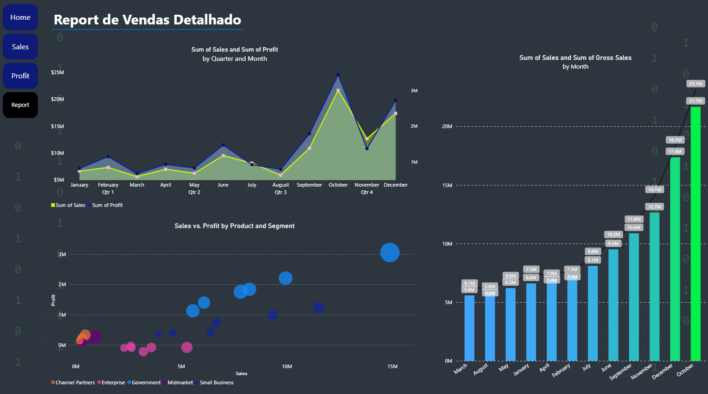

# Dashboard de Desempenho de Vendas | Power BI

Dashboard interativo desenvolvido no Power BI para análise de desempenho comercial, com foco em vendas, lucro, vendas brutas, unidades vendidas, produtos, segmentos e evolução ao longo do tempo.

Este projeto faz parte da minha jornada de aprendizado prático em Power BI, com foco em transformar dados em informações visuais que apoiem a análise de resultados.

---

## 📊 Visão Geral

O dashboard é composto por quatro páginas:

- **Home:** Página inicial e navegação do projeto.
- **Sales:** Análise de vendas, evolução mensal e desempenho por produto e segmento.
- **Profit:** Análise de lucratividade e distribuição dos resultados.
- **Report:** Relatório detalhado combinando vendas, lucro e unidades vendidas.

---

## 🖼️ Prévia do Dashboard

### Home

### Sales

### Profit

### Report

---

## 🎯 Objetivo do Projeto

O objetivo foi desenvolver um dashboard interativo capaz de apresentar informações relevantes sobre o desempenho comercial, permitindo explorar:

- Evolução das vendas ao longo do tempo;
- Comparação entre vendas e lucro;
- Análise de vendas brutas;
- Desempenho por produto e segmento;
- Relação entre vendas, lucro e unidades vendidas;
- Visualização detalhada dos resultados.

---

## 🛠️ Ferramentas e Tecnologias

- Power BI
- Power Query
- DAX
- Modelagem de Dados
- Visualização de Dados
- Design de Dashboards

---

## 📈 Principais Visualizações

- Cartões de indicadores (KPIs);
- Gráficos de linha e área;
- Gráficos de colunas;
- Gráfico de dispersão (Scatter Chart);
- Treemap;
- Matriz de dados;
- Filtros de período;
- Navegação interativa entre páginas.

---

## 📚 O que pratiquei

Durante o desenvolvimento deste projeto, pratiquei:

- Importação e transformação de dados;
- Organização e modelagem de dados;
- Criação de medidas utilizando DAX;
- Construção de indicadores;
- Desenvolvimento de páginas interativas;
- Aplicação de princípios de hierarquia visual;
- Criação de dashboards com foco em análise de negócio.

---

## 🚀 Status do Projeto

Projeto concluído como parte do meu aprendizado prático em Power BI.

---

## 👤 Autor

**Angelo Morozini**

Estudante de Análise e Desenvolvimento de Sistemas, desenvolvendo projetos práticos em Análise de Dados, Power BI, SQL e Tecnologia da Informação.

---

⭐ Projeto desenvolvido para fins de aprendizado e composição de portfólio profissional.
